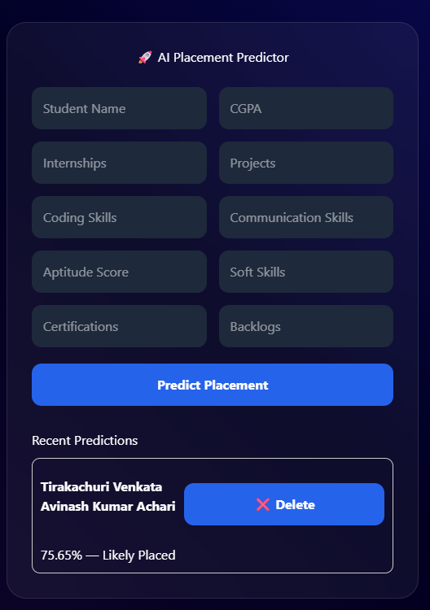
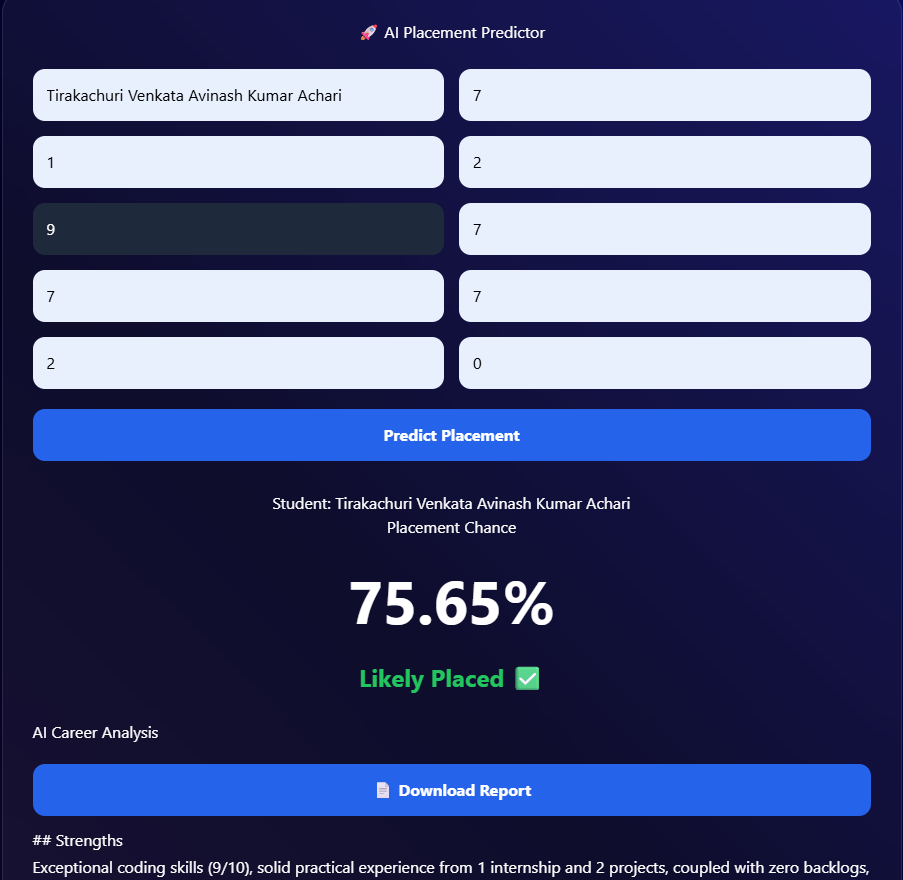
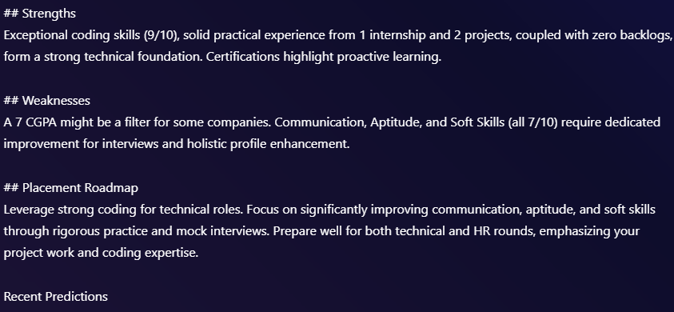
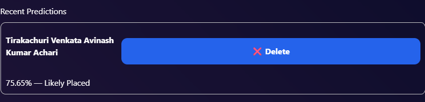
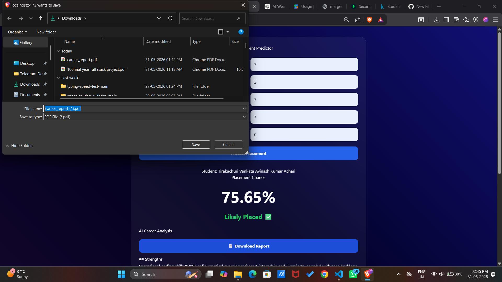

# 🚀 AI Placement Predictor

An AI-powered Placement Prediction and Career Guidance System built using **React.js, Flask, Scikit-Learn, MongoDB Atlas, and Google Gemini AI**.

The application predicts a student's placement probability based on academic and skill-related metrics and generates personalized AI-powered career guidance.

---

# 🌟 Features

✅ Placement Prediction using Machine Learning

✅ Placement Probability Score

✅ AI Career Analysis using Google Gemini

✅ Personalized Strengths & Weaknesses Analysis

✅ Career Roadmap Recommendations

✅ MongoDB Atlas Database Integration

✅ Prediction History Tracking

✅ Delete Previous Predictions

✅ PDF Career Report Download

✅ Responsive Modern User Interface

---

# 📸 Screenshots

## Home Page

> Add screenshot here



---

## Placement Prediction Result

> Add screenshot here



---

## AI Career Analysis

> Add screenshot here



---

## Prediction History

> Add screenshot here



---

## PDF Report Download

> Add screenshot here



---

# 🧠 Machine Learning Model

### Algorithm Used

* Logistic Regression

### Features Used

* CGPA
* Internships
* Projects
* Coding Skills
* Communication Skills
* Aptitude Test Score
* Soft Skills Rating
* Certifications
* Backlogs

### Model Accuracy

**Accuracy: 86.42%**

```text
Accuracy: 0.8642222222222222
```

The model was trained using Scikit-Learn and serialized using Joblib.

---

# 🤖 AI Career Guidance

Google Gemini AI analyzes the student's profile and generates:

### Strengths

* Technical strengths
* Academic strengths
* Experience-based strengths

### Weaknesses

* Skill gaps
* Academic concerns
* Interview readiness issues

### Placement Roadmap

* Improvement suggestions
* Career recommendations
* Placement preparation guidance

---

# 🏗️ Tech Stack

## Frontend

* React.js
* Axios
* CSS3

## Backend

* Flask
* Flask-CORS

## Machine Learning

* Scikit-Learn
* Pandas
* NumPy
* Joblib

## Database

* MongoDB Atlas
* PyMongo

## Artificial Intelligence

* Google Gemini API

## PDF Generation

* ReportLab

---

# 📂 Project Structure

```text
placement-predictor
│
├── client
│   ├── public
│   ├── src
│   │   ├── App.jsx
│   │   ├── App.css
│   │   └── main.jsx
│   └── package.json
│
├── ml
│   ├── train.py
│   ├── train.csv
│   └── placement_model.pkl
│
├── server
│   ├── app.py
│   ├── requirements.txt
│   └── .env
│
└── README.md
```

---

# ⚙️ Installation

## Clone Repository

```bash
git clone https://github.com/YOUR_USERNAME/placement-predictor.git

cd placement-predictor
```

---

## Frontend Setup

```bash
cd client

npm install

npm run dev
```

Frontend runs at:

```text
http://localhost:5173
```

---

## Backend Setup

```bash
cd server

pip install -r requirements.txt

python app.py
```

Backend runs at:

```text
http://127.0.0.1:5000
```

---

# 🔑 Environment Variables

Create a `.env` file inside the `server` folder.

```env
GEMINI_API_KEY=YOUR_GEMINI_API_KEY

MONGO_URI=YOUR_MONGODB_CONNECTION_STRING
```

---

# 📊 API Endpoints

## Home

```http
GET /
```

---

## Predict Placement

```http
POST /predict
```

Returns:

```json
{
  "prediction": 1,
  "probability": 88.7,
  "advice": "AI generated career guidance..."
}
```

---

## Prediction History

```http
GET /history
```

---

## Delete Prediction

```http
DELETE /delete/<id>
```

---

## Download PDF Report

```http
POST /report
```

---

# 🚀 Future Enhancements

* User Authentication
* Admin Dashboard
* Analytics & Charts
* Placement Trend Analysis
* Resume Analyzer
* Interview Preparation Assistant
* Email Report Sharing
* Company Recommendation Engine

---

# 🎯 Key Learnings

* Full Stack Development
* REST API Design
* Machine Learning Integration
* MongoDB CRUD Operations
* AI API Integration
* PDF Generation
* Deployment Workflow
* State Management in React

---

# 👨‍💻 Author

**Avinash Kumar Tirakachuri**

Final Electronics and Instrumentation EngineeringStudent

Passionate about:

* Artificial Intelligence
* Machine Learning
* Full Stack Development
* Data Engineering

---

# ⭐ If you found this project useful

Please consider giving it a star on GitHub.
